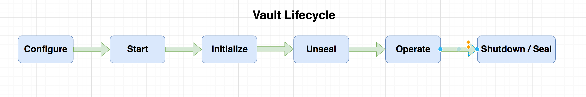
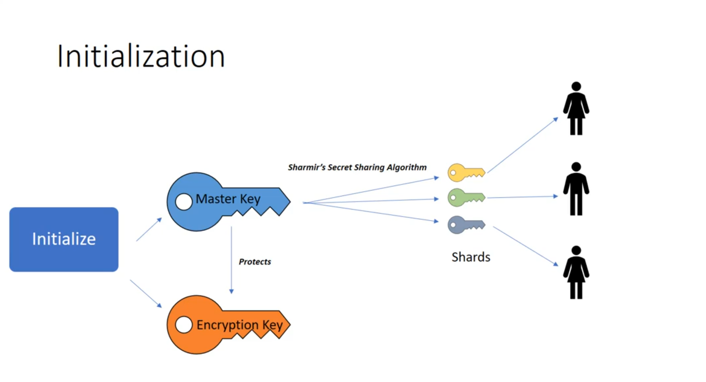

#### Stages of Vault Lifecycle

   

#### Configure 
1.  Identify the storage backend that meets your need example S3, Consul, filesystem, etcd
2.  Declare config in HCL config file.
3.  Configure network listeners.  

```hcl
#store in the file, vault_config.hcl
  
storage "consul"{
  address="127.0.0.1:5000"
  path = vault
}

listener "tcp"{
  address="example.host.com:PORT"
  tls_disable=1
}
```   

#### Start
Once the configuration is captured in the file, start the vault server by running the command
```bash
$ vault server -config=vault_config.hcl
```

#### Initialize
When the vault is started, the next step is to initialize it. This is one time process which includes few steps
   1. Encryption keys are created
   2. Unseal Keys are created
   3. Root token is created
```bash
$ vault operator init
    
Unseal Key 1: RqX7wxZF8LUAfdDKlaLhQtg902QQvMBbmErKDrtuySh2
Unseal Key 2: Co7GMEOlazAAVGy531tUHAHmtz+qWawAAVtew5dk7AwQ
Unseal Key 3: 9+Wgil96JliZmuqndK5Haf+vndeXHPmmsGI85VJkettF
Unseal Key 4: wy/YAjFFI2tQZ7ML5Qs0F94F6MCSiZiZj0lixb9Ml6oM
Unseal Key 5: o58O3DEiITJRh+pbBQmRI+wUoRuAbaztRWDDW30rSDBf
    
Initial Root Token: 705b4f84-9b82-41df-dcbe-01e51e5fc1d7
    
Vault initialized with 5 key shares and a key threshold of 3. Please securely
distribute the key shares printed above. When the Vault is re-sealed,
restarted, or stopped, you must supply at least 3 of these keys to unseal it
before it can start servicing requests.
    
Vault does not store the generated master key. Without at least 3 key to
reconstruct the master key, Vault will remain permanently sealed!
``` 
    
Vault is started in sealed state.When it is in sealed state it cannot be accessed.
Vault itself has no idea how to decrypt any data that it holds. It must be unsealed by reconstructing the Master key.
During the initialization phase a Master key is generated and broken into Shards.
These shards are distributed to team members.
A master key can be reconstructed by combining subset of these shards.Master key protects the encryption key.
    
   

